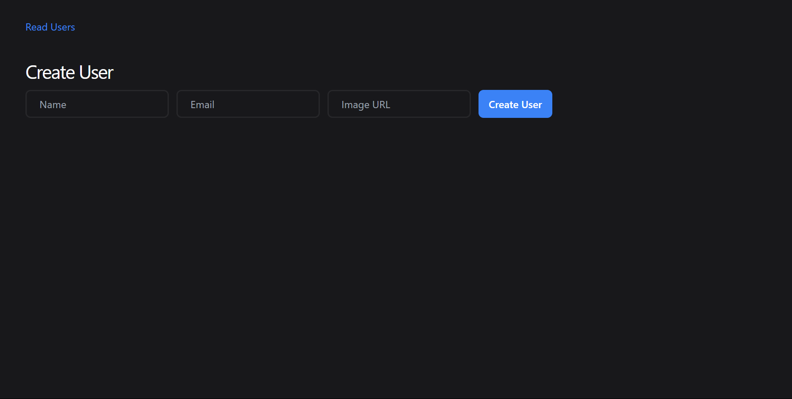

# UserCRUD

UserCRUD is a simple web application that allows users to create, read, update, and delete (CRUD) user profiles. The application provides a user-friendly interface for managing user details, including name, email, and profile image URL.

## Features
- Add a new user with name, email, and image URL
- View a list of all registered users
- Edit user details
- Delete users
- Responsive and clean UI built with Tailwind CSS

## Technologies Used
- **EJS** – For templating and rendering dynamic content  
- **Tailwind CSS** – For styling and responsive layout  
- **Node.js** – For server-side JavaScript runtime  
- **Express.js** – For handling backend logic and API routes  
- **MongoDB** – For database storage and management  


## Installation
1. Clone the repository:
   ```sh
   git clone https://github.com/Sorabh-jangir-333/UserCRUD.git
   ```
2. Navigate to the project folder:
   ```sh
   cd UserCRUD
   ```
3. Open `app.js` in your browser.

## Usage
1. Enter user details (name, email, and image URL) in the input fields.
2. Click "Create User" to add a new user.
3. View all users on the "Read Users" page.
4. Edit or delete user records as needed.

## Screenshots



## License
This project is licensed under the MIT License.

## Author
Created by Sorabh

